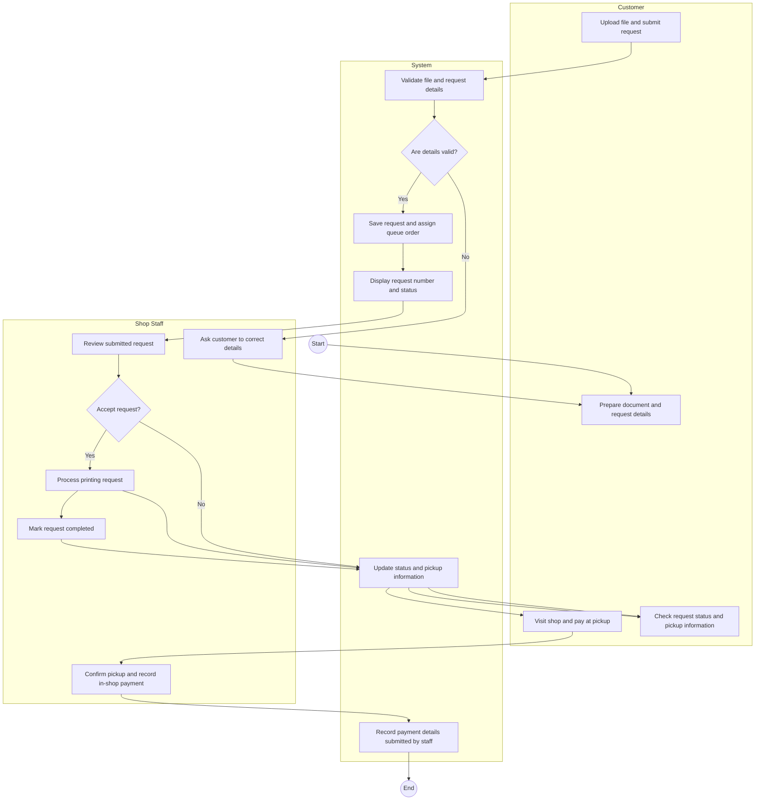

# 4. UML Activity Diagram — Submit Printing Request to Pickup

**Scope:** Core workflow from customer submission through staff processing and in-shop pickup.

**Key:** Diamonds are decisions; branch labels are guard conditions. Payment is made in person at pickup, not through an online gateway.
