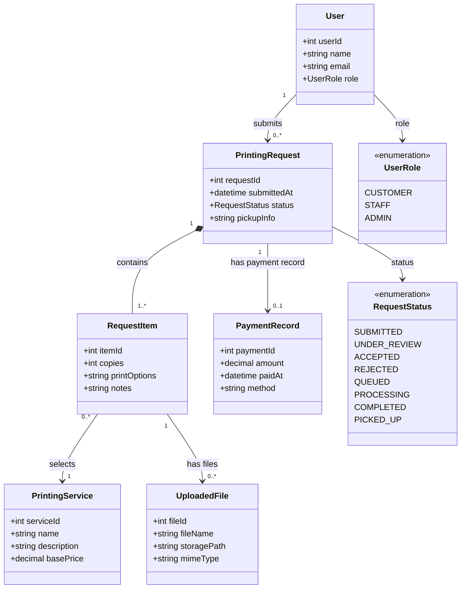

# 6. UML Class Diagram — Hannah Printing Shop Domain Model

**Scope:** Core domain classes, typed attributes, associations, multiplicities, and status enumerations.

**Key:** `1`, `0..1`, `0..*`, and `1..*` show association multiplicity. Enumerations define valid role and request-status values.

**Validation note:** This is a draft domain model. Confirm that each association, field, and multiplicity matches your actual MVP and database implementation.
