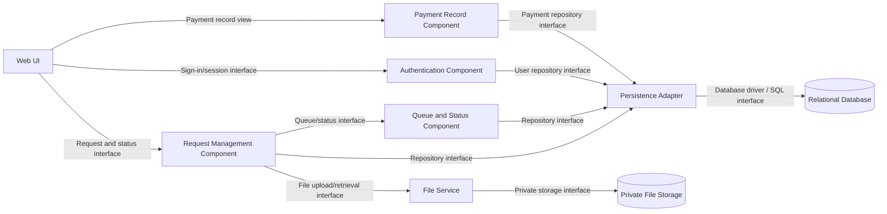

# 9. UML Component Diagram — Application/API Components

**Scope:** Main application components, their interfaces, and dependencies. External services are not assumed in this MVP.

**Interfaces:** Authentication provides sign-in/session handling; Request Management provides request operations; Queue and Status provides queue/status operations; File Service provides private file upload/retrieval; Payment Record provides in-shop payment entry; Persistence Adapter provides repository access to the relational database.

**Security boundary:** The browser must not access private uploaded files or the database directly. Payment is recorded by staff after in-person payment.
