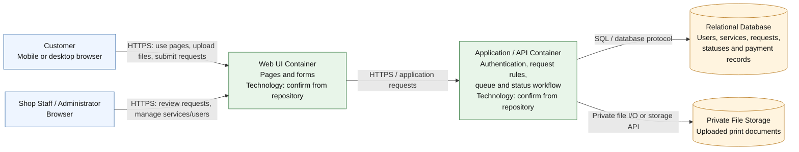

# 2. C4 Container Diagram — Hannah Printing Shop System

**Scope:** Logical application containers and the main communication paths. Technology choices are provisional and must be confirmed against the actual repository.

**Key:** Browser roles are users, UI and Application/API are software containers, and Database/File Storage are data containers.

**Container decision:** This draft shows the Web UI and Application/API as two logical containers. Confirm whether the implementation and deployment actually separate them before final submission. Framework, database engine, hosting provider, and storage technology remain provisional.
