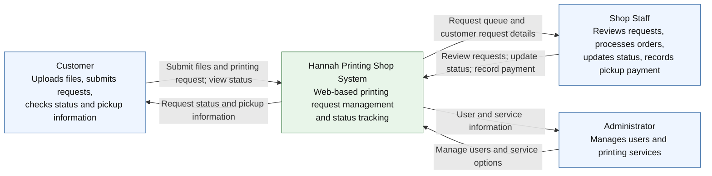

# 1. C4 System Context Diagram — Hannah Printing Shop System

**Scope:** People and external systems interacting with the Hannah Printing Shop System.

**Key:** People are shown as role boxes; the central box is the system being designed. Arrows describe the purpose of each interaction.

**Boundary note:** The MVP does not use an external payment processor and does not include online payment or delivery.
