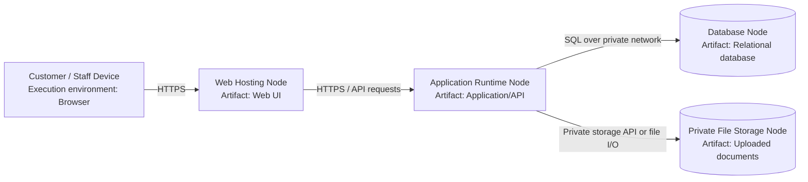

# 10. UML Deployment Diagram — Provisional

**Scope:** Provisional runtime nodes and artifacts. Generic hosting names are used because the final provider and implementation settings must be confirmed.

**Key:** Nodes represent runtime environments; labels inside nodes identify deployed artifacts; every connection is labelled with a protocol or access method.

**Provisional assumptions to confirm:** Hosting provider, application runtime, database engine, private file storage, backups, and access controls. No secrets, credentials, or real server addresses are included.
