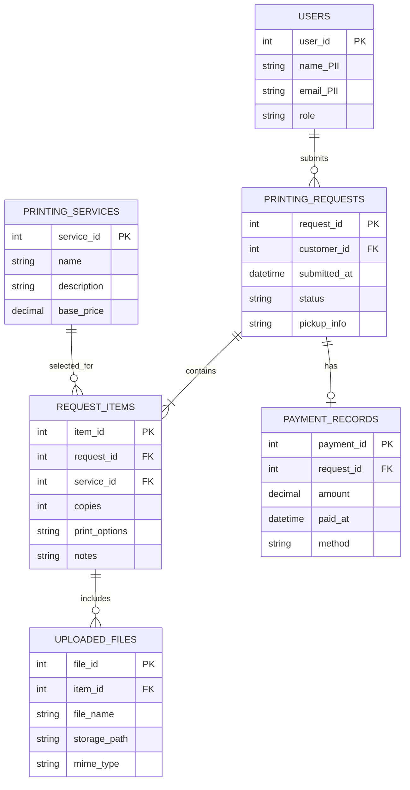

# 11. Entity Relationship Diagram (Draft) — Hannah Printing Shop

**Scope:** Draft relational tables derived from the class diagram. Fields containing personally identifiable information (PII) are marked `[PII]`.

**Key:** `PK` = primary key; `FK` = foreign key; `[PII]` marks personally identifiable information. Crow's-foot symbols indicate one-to-many or optional relationships.

**Validation note:** Confirm foreign-key names and whether uploaded files link to `REQUEST_ITEMS` or directly to `PRINTING_REQUESTS` using the actual database schema before treating this ERD as final.
