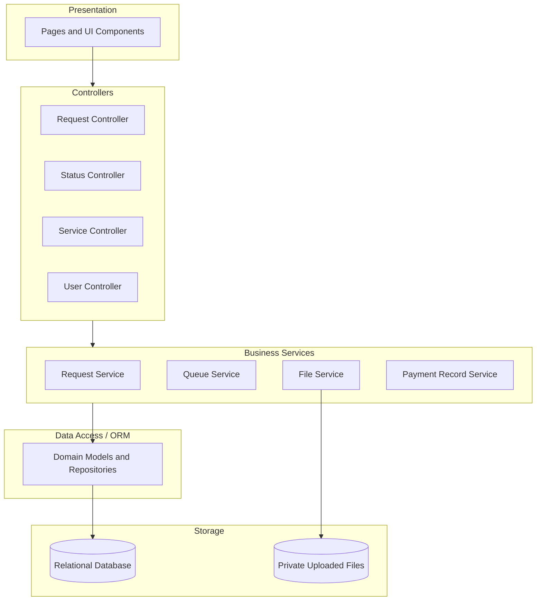

# 8. UML Package Diagram — Proposed Application Layers

**Scope:** Proposed folder/package responsibilities and dependencies for the Hannah Printing Shop System.

**Layering rule:** Presentation calls controllers; controllers use business services; business services access persisted data through the data-access layer, and uploaded files are handled through the File Service rather than accessed directly by the browser.
