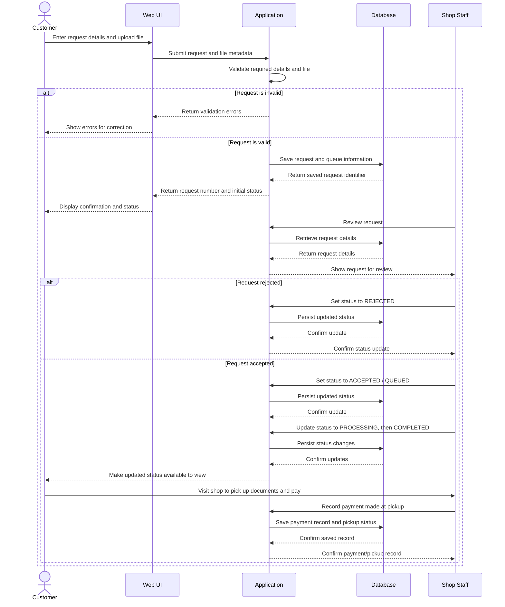

# 5. UML Sequence Diagram — Request Submission, Status Updates, and Pickup Payment

**Scope:** A higher-risk workflow involving uploaded files, request persistence, status changes, and payment recording.

**Key:** Solid arrows are requests/actions; dashed arrows are replies. No external payment gateway is called. Payment is recorded only after the customer pays at the shop.
