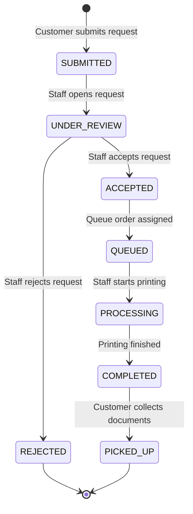

# 7. UML State Machine Diagram — PrintingRequest Status

**Scope:** Lifecycle of the main entity, `PrintingRequest`. State names correspond to the `RequestStatus` enumeration in `class.md`.

**Key:** Rounded states represent the current condition of a printing request; arrow labels identify events that trigger transitions.

**Validation note:** If the implemented system allows other transitions, revise this diagram and the `RequestStatus` enumeration together so they remain consistent.
