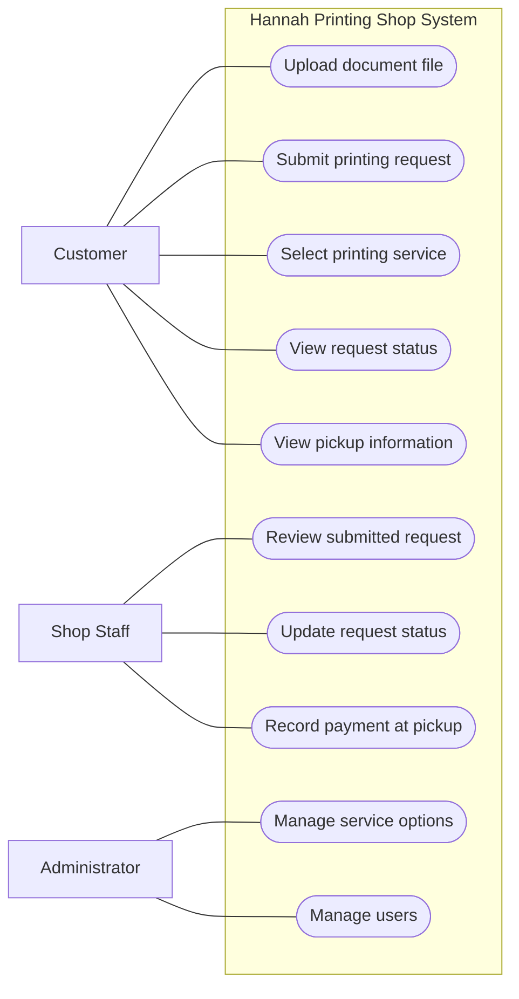

# 3. UML Use Case Diagram — Hannah Printing Shop MVP

**Scope:** Goal-level actions included in the MVP. Online payment and delivery are excluded.

**Key:** Actors are outside the system boundary; ovals are user goals supported by the MVP.
